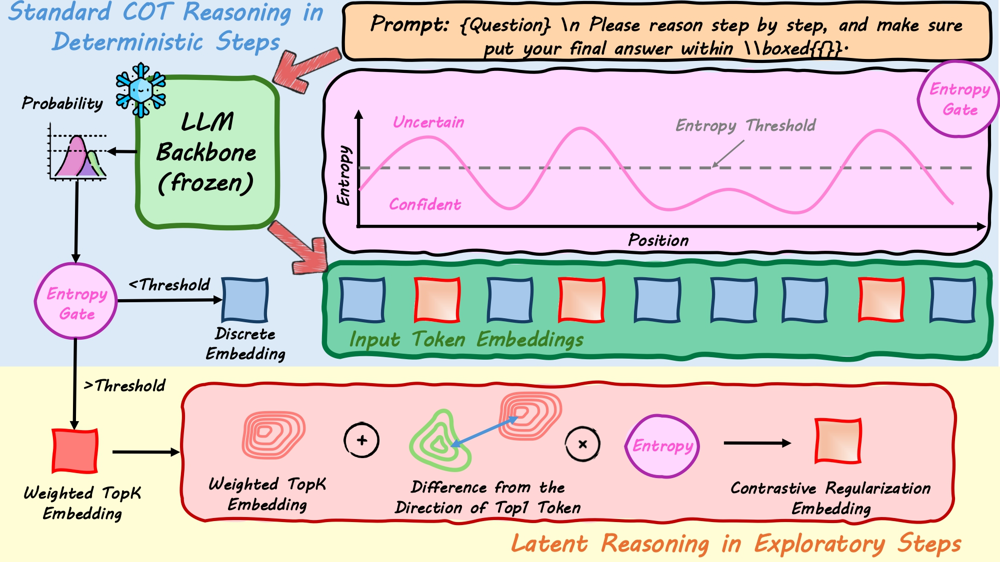

<div align="center">
<h1>SeLaR: Selective Latent Reasoning in Large Language Models</h1>
</div>

<p align="center">
    <a href="https://arxiv.org/abs/">
        
    </a>
</p>

## 📌 Overview

**SeLaR** (Selective Latent Reasoning) is a lightweight, training-free framework that enhances chain-of-thought reasoning in large language models. Unlike existing latent reasoning methods that apply soft embeddings globally, SeLaR introduces:

1. **Entropy-Gated Selective Mechanism**: Dynamically activates latent reasoning only at high-entropy (uncertain) decision steps, while preserving standard discrete decoding at low-entropy (confident) steps.

2. **Entropy-Aware Contrastive Regularization**: Mitigates premature collapse of soft embeddings toward dominant tokens, encouraging sustained exploration across multiple reasoning paths.

## 🔬 Framework

<div align="center">

</div>

### How SeLaR Works

**Step 1: Entropy Computation**
At each decoding step, SeLaR computes the normalized entropy over top-k token probabilities to measure model uncertainty.

**Step 2: Selective Activation**
- **High Entropy (≥ threshold)** → Activate latent reasoning with soft embeddings
- **Low Entropy (< threshold)** → Use standard discrete token sampling

**Step 3: Contrastive Regularization**
When latent reasoning is activated, SeLaR applies entropy-aware contrastive regularization to push soft embeddings away from the dominant token direction, preserving exploration of alternative reasoning paths.

## 🎯 Key Features

- **Training-Free**: No fine-tuning required, works with any pre-trained reasoning LLM
- **Selective Activation**: Latent reasoning activated at only 6.2%–13.8% of reasoning steps
- **Improved Performance**: Consistently outperforms standard CoT and existing training-free methods
- **Faster Inference**: 28.6% speedup over CoT with 12.4% fewer generated tokens
- **Model Agnostic**: Compatible with Qwen3, DeepSeek-R1-Distill, and other reasoning models

## 📊 Results

SeLaR achieves state-of-the-art performance across five reasoning benchmarks:

| Model | Method | GSM8K | MATH500 | GPQA | AIME24 | AIME25 | Avg |
|-------|--------|-------|---------|------|--------|--------|-----|
| Qwen3-1.7B | CoT (Sampling) | 90.30 | 92.20 | 38.89 | 43.33 | 30.00 | 58.94 |
| | **SeLaR** | **90.52** | **92.60** | 35.35 | **53.33** | **36.67** | **61.69** |
| Qwen3-8B | CoT (Sampling) | 95.22 | 96.00 | 59.09 | 76.67 | 66.67 | 78.73 |
| | **SeLaR** | **95.83** | **97.00** | **61.62** | **83.33** | **80.00** | **83.56** |
| Qwen3-32B | CoT (Sampling) | 95.83 | 97.40 | 66.16 | 80.42 | 72.08 | 82.38 |
| | **SeLaR** | **96.06** | **97.60** | 67.17 | **83.33** | **80.00** | **84.83** |

**Key Findings:**
- SeLaR is the only method that consistently surpasses CoT baseline across all model sizes
- Significant gains on challenging benchmarks (AIME 2024/2025): up to +13.33% on AIME 2025 for Qwen3-8B
- 28.6% faster inference than CoT (4.87s vs 6.82s per sample on GSM8K)

## 🚀 Quick Start

### Installation

```bash
conda create -n selar python=3.12
conda activate selar
pip install -r requirements.txt
```

### Basic Usage

```bash
# Evaluate SeLaR on GSM8K
torchrun --nproc_per_node 1 --nnodes 1 --node_rank 0 --master_port $((RANDOM + 20000)) \
    scripts/run.py --model_name Qwen/Qwen3-8B --dataset_name gsm8k \
    --batch_size 256 --max_new_tokens 32768 --method selar \
    --selar_topk 3 --entropy_threshold 0.5

# Merge results
python scripts/merge.py --model_name Qwen/Qwen3-8B --dataset_name gsm8k \
    --max_new_tokens 32768 --method selar
```

## 📁 Repository Structure

```
SeLaReasoning/
├── src/                          # Core source code
│   ├── generation_utils.py       # Generation functions (CoT, SeLaR, etc.)
│   ├── grader.py                 # Answer extraction and grading
│   ├── compute_entropy.py        # Entropy analysis tools
│   └── visualize_entropy.py      # Visualization utilities
├── scripts/                      # Execution scripts
│   ├── run.py                    # Main evaluation script
│   ├── run_chat.py               # Interactive chat interface
│   ├── merge.py                  # Result merging utility
│   ├── run.sh                    # Batch evaluation examples
│   └── run_chat.sh               # Chat examples
├── notebooks/                    # Jupyter notebooks
│   └── visual.ipynb              # Analysis and visualization
├── datasets/                     # Benchmark datasets
│   ├── gsm8k_test/
│   ├── math_500_test/
│   ├── aime_2024_train/
│   ├── aime_2025/
│   └── gpqa_diamond_mc_test/
└── results/                      # Experimental results
    ├── logs/
    └── merged_results/
```

## 🔧 Method Details

### Entropy-Gated Selective Mechanism

At each decoding step, SeLaR computes the normalized entropy over top-k token probabilities:

1. **High Entropy (≥ threshold)**: Activate latent reasoning with soft embeddings
2. **Low Entropy (< threshold)**: Use standard discrete token sampling

The threshold τ is dataset-dependent:
- GSM8K: τ = 0.5
- MATH500: τ = 0.5
- GPQA-Diamond: τ = 0.7
- AIME 2024: τ = 0.4
- AIME 2025: τ = 0.5

### Entropy-Aware Contrastive Regularization

To prevent premature collapse toward dominant tokens, SeLaR applies:

```
ẽ'ₜ = ẽₜ + H̄ₜ · Δ̂ₜ · ‖Δₜ‖
```

Where:
- `ẽₜ` is the soft embedding
- `H̄ₜ` is normalized entropy
- `Δ̂ₜ` is the unit direction from dominant token to soft embedding

This formulation amplifies displacement from the dominant token proportionally to current uncertainty.

## 📝 Citation

If you find this work useful, please cite:

```bibtex
@misc{yourname2025selar,
    title={SeLaR: Selective Latent Reasoning in Large Language Models},
    author={Your Name and Co-authors},
    year={2025},
    eprint={},
    archivePrefix={arXiv},
    primaryClass={cs.CL}
}
```

## 🙏 Acknowledgments

We thank the contributors of open-source projects [Transformers](https://github.com/huggingface/transformers) and [Qwen3](https://github.com/QwenLM/Qwen3).

We are particularly grateful to the authors of [SwiReasoning](https://github.com/sdc17/SwiReasoning) for open-sourcing their excellent work. Our code builds upon their repository, and we encourage users to also cite and acknowledge their contributions. 

## 📄 License

This project is licensed under the MIT License - see the [LICENSE](LICENSE) file for details.
