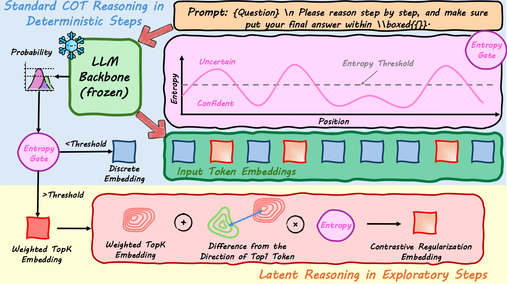

<div align="center">
  <h1>SeLaR: Selective Latent Reasoning in Large Language Models</h1>
</div>
<p align="center">
    <a href="http://arxiv.org/abs/2604.08299">
        
        
    </a>
</p>

## 📌 Overview

**SeLaR** (Selective Latent Reasoning) is a lightweight, training-free framework that enhances chain-of-thought reasoning in large language models. Unlike existing latent reasoning methods that apply soft embeddings globally, SeLaR introduces:

1. **Entropy-Gated Selective Mechanism**: Dynamically activates latent reasoning only at high-entropy (uncertain) decision steps, while preserving standard discrete decoding at low-entropy (confident) steps.

2. **Entropy-Aware Contrastive Regularization**: Mitigates premature collapse of soft embeddings toward dominant tokens, encouraging sustained exploration across multiple reasoning paths.

## 🔬 Framework

<div align="center">

</div>

### How SeLaR Works

**Step 1: Entropy Computation**
At each decoding step, SeLaR computes the normalized entropy over top-k token probabilities to measure model uncertainty.

**Step 2: Selective Activation**
- **High Entropy (≥ threshold)** → Activate latent reasoning with soft embeddings
- **Low Entropy (< threshold)** → Use standard discrete token sampling

**Step 3: Contrastive Regularization**
When latent reasoning is activated, SeLaR applies entropy-aware contrastive regularization to push soft embeddings away from the dominant token direction, preserving exploration of alternative reasoning paths.

## 📊 Results

SeLaR achieves state-of-the-art performance across five reasoning benchmarks:

### Qwen3-8B

| Method | GSM8K | MATH500 | GPQA | AIME24 | AIME25 | Avg |
|--------|-------|---------|------|--------|--------|-----|
| CoT (Sampling) | 95.45 | **98.00** | 61.62 | 76.67 | 66.67 | 79.68 |
| CoT (Greedy) | 95.22 | 96.20 | 55.05 | 70.00 | 63.33 | 75.96 |
| Soft Thinking | 94.92 | 95.80 | 57.58 | 70.00 | 66.67 | 76.99 |
| SwiR | 95.68 | 97.00 | **62.63** | 60.00 | 66.67 | 76.40 |
| **SeLaR** | **95.83** | 97.00 | 61.62 | **83.33** | **80.00** | **83.56** |


## 🚀 Quick Start

### Installation

```bash
conda create -n selar python=3.12
conda activate selar
pip install -r requirements.txt
```

### Basic Usage

```bash
# Evaluate SeLaR on GSM8K
torchrun --nproc_per_node 1 --nnodes 1 --node_rank 0 --master_port $((RANDOM + 20000)) \
    scripts/run.py --model_name Qwen/Qwen3-8B --dataset_name gsm8k \
    --batch_size 256 --max_new_tokens 32768 --method selar \
    --selar_topk 3 --entropy_threshold 0.5

# Merge results
python scripts/merge.py --model_name Qwen/Qwen3-8B --dataset_name gsm8k \
    --max_new_tokens 32768 --method selar
```

## 📁 Repository Structure

```
SeLaReasoning/
├── src/                          # Core source code
│   ├── generation_utils.py       # Generation functions (CoT, SeLaR, etc.)
│   ├── grader.py                 # Answer extraction and grading
├── scripts/                      # Execution scripts
│   ├── run.py                    # Main evaluation script
│   ├── merge.py                  # Result merging utility
├── datasets/                     # Benchmark datasets
│   ├── gsm8k_test/
│   ├── math_500_test/
│   ├── aime_2024_train/
│   ├── aime_2025/
│   └── gpqa_diamond_mc_test/
└── results/                      # Our Experimental results
```

## 📝 Citation

If you find this work useful, please cite:

```bibtex
@misc{fu2026selarselectivelatentreasoning,
      title={SeLaR: Selective Latent Reasoning in Large Language Models}, 
      author={Renyu Fu and Guibo Luo},
      year={2026},
      eprint={2604.08299},
      archivePrefix={arXiv},
      primaryClass={cs.CL},
      url={https://arxiv.org/abs/2604.08299}, 
}
```

## 🙏 Acknowledgments

We thank the contributors of open-source projects [Transformers](https://github.com/huggingface/transformers) and [Qwen3](https://github.com/QwenLM/Qwen3).

We are particularly grateful to the authors of [SwiReasoning](https://github.com/sdc17/SwiReasoning) for open-sourcing their excellent work. Our code builds upon their repository, and we encourage users to also cite and acknowledge their contributions. 
